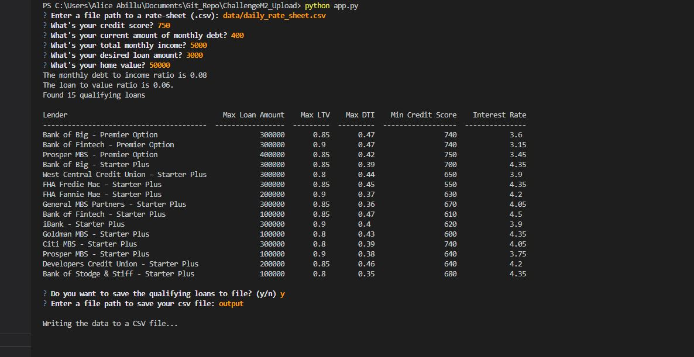
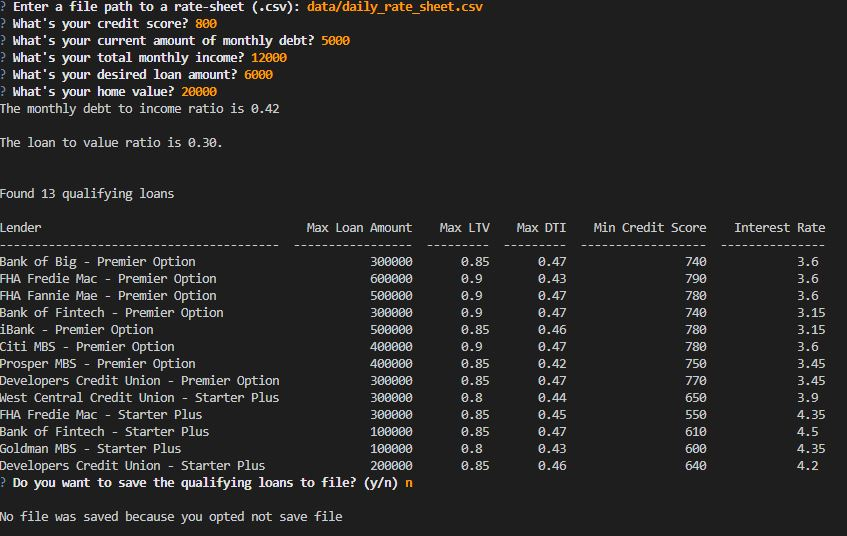
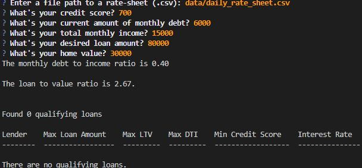

# Loan Qualifier Application
This application allows user to save the qualifying loans easily to a CSV file to faciliate sharing the results on a spreadsheet. This application works by taking in a 'daily_rate_sheet'

---

## Technologies

This project leverages python 3.7 wih the following packages: 
* [fire](https://github.com/google/python-fire) - For command line interface, help page, and entry point.
* [questionary](https://github.com/tmbo/questionary) - For interactive usser prompts and dialogues.
---

## Installation Guide

Before running the application first install the following dependencies:
```python
pip install fire
pip install questionary
```

---

## Usage

To use the loan qualifier application simply clone the repository and run the **app.py** with:
```python 
python app.py
```


```text
Upon launching the loan qualifier application you will be greeted with the following prompts:
```



---

## Contributors

Brought to you by Incredible Loans for All

---

## License

MIT
